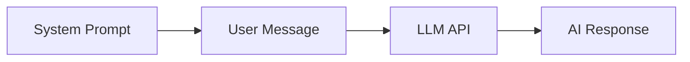
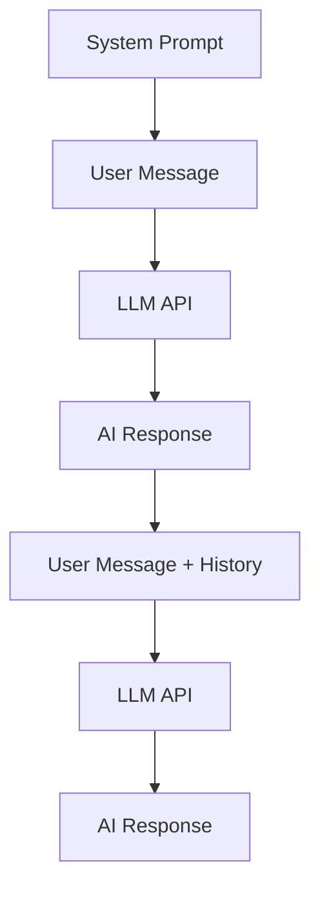

# AI101: Working with Large Language Models

## Dedication

This repository is dedicated to Maria - a gesture from DKMaker to help her learn the basics of AI and APIs. May this be the beginning of an exciting journey into the world of artificial intelligence and language models.


## Introduction

Welcome to AI101, a comprehensive guide and toolkit for interacting with Large Language Models (LLMs) through OpenRouter API. This repository provides practical examples and tools for developers who want to understand and leverage LLM capabilities in their applications.

[OpenRouter](https://openrouter.ai/) is a unified API that gives you access to the best LLMs from various providers (OpenAI, Anthropic, Google, etc.) through a single, consistent interface. This approach simplifies development and allows you to easily switch between different models.

This repository focuses on two main approaches:
1. Using the **VS Code REST Client** extension to make direct API calls to OpenRouter
2. Implementing a **PowerShell chat client** that maintains conversation state and provides a simple interface for interacting with LLMs

Whether you're new to working with LLMs or looking to enhance your existing knowledge, this repository offers practical examples and reusable components to help you get started quickly.

## LLM Concepts

### Stateless Nature of LLMs

LLMs like GPT-4 are fundamentally **stateless**. Each time you send a request to the model:

- The model does not inherently "remember" previous interactions
- Each request is processed independently
- The model re-evaluates the entire provided context for each response

This stateless nature means that to maintain a "conversation," you must:
1. Track the conversation history on your side
2. Send the entire relevant conversation history with each new request
3. Manage the context window limitations

### Context Windows and Tokens

LLMs process text as "tokens" (roughly 4 characters per token in English):

- Each model has a maximum context window (e.g., 8K, 16K, or 32K tokens)
- This window includes both the input (prompt + history) and the generated output
- Exceeding this limit will result in truncation or errors

### Message Roles

When interacting with chat-based LLMs, messages are structured with specific roles:

- **System**: Sets the behavior, personality, or capabilities of the assistant
- **User**: Contains the end-user's inputs or questions
- **Assistant**: Contains the model's previous responses
- **Tool/Function**: Contains inputs/outputs when the model uses tools or functions

### Tools and Functions

Modern LLMs can be extended with tools or functions:

- These allow the model to take actions beyond generating text
- Examples include: retrieving information, performing calculations, or calling external APIs
- The model can decide when to use these tools based on the user's request
- Tool use requires proper configuration and handling in your application

### Multimodal Capabilities

Many modern LLMs support multimodal inputs, allowing them to process both text and images:

- Models like GPT-4o can analyze images and respond to questions about them
- This enables use cases like visual question answering, image description, and content analysis
- Multimodal requests require structuring the user message with both text and image components
- OpenRouter provides access to various multimodal models through a consistent API

### Static Data Exposure

There are several ways to expose static data to an LLM:

1. **Direct inclusion in prompts**: Embedding data directly in the system or user message
2. **Retrieval-augmented generation (RAG)**: Dynamically fetching relevant information based on the query
3. **Fine-tuning**: Training the model on specific datasets to internalize information
4. **Tool/function calling**: Providing data access through custom functions

## Interaction Flow

### Basic Interaction Pattern



### Conversation Flow



### Example Interaction

Here's a simple example of a complete interaction:

**System Prompt:**
```
You are a helpful AI assistant that provides concise information about programming topics.
```

**User Message:**
```
What is the difference between let and const in JavaScript?
```

**Assistant Response:**
```
In JavaScript:

- `let` declares variables that can be reassigned later
- `const` declares variables that cannot be reassigned after initialization

Both provide block scope, unlike the older `var` declaration. Use `const` by default, and `let` only when you need to reassign the variable.
```

**User Follow-up:**
```
Can you show me an example of when to use each?
```

**Complete API Request (including history):**
```json
{
  "model": "openai/chatgpt-4o-latest",
  "messages": [
    {
      "role": "system",
      "content": "You are a helpful AI assistant that provides concise information about programming topics."
    },
    {
      "role": "user",
      "content": "What is the difference between let and const in JavaScript?"
    },
    {
      "role": "assistant",
      "content": "In JavaScript:\n\n- `let` declares variables that can be reassigned later\n- `const` declares variables that cannot be reassigned after initialization\n\nBoth provide block scope, unlike the older `var` declaration. Use `const` by default, and `let` only when you need to reassign the variable."
    },
    {
      "role": "user",
      "content": "Can you show me an example of when to use each?"
    }
  ]
}
```

## VS Code REST Client

The [REST Client](https://marketplace.visualstudio.com/items?itemName=humao.rest-client) extension for Visual Studio Code provides a convenient way to send HTTP requests and view responses directly within VS Code. This makes it an excellent tool for testing and exploring LLM APIs.

### Setting Up REST Client

1. Install the REST Client extension from the VS Code marketplace
2. Create `.http` or `.rest` files to define your requests
3. Use environment variables for sensitive information like API keys

### Environment Setup

Create a file named `.vscode/settings.json` in your project with your API keys (make sure to add this file to `.gitignore`):

```json
{
  "rest-client.environmentVariables": {
    "$shared": {
      "baseUrl": "https://openrouter.ai/api/v1"
    },
    "development": {
      "apiKey": "your-openrouter-api-key-here"
    }
  }
}
```

### Example Request Format

```http
### Chat Completion Request
POST {{baseUrl}}/chat/completions
Content-Type: application/json
Authorization: Bearer {{apiKey}}
HTTP-Referer: https://ai101.example.com
X-Title: AI101 REST Client

{
  "model": "openai/chatgpt-4o-latest",
  "messages": [
    {
      "role": "system",
      "content": "You are a helpful assistant."
    },
    {
      "role": "user",
      "content": "Hello, who are you?"
    }
  ]
}
```

## Example Requests Index

This repository includes several example `.http` files demonstrating different types of requests:

1. **[Chat Completions](rest-examples/chat.http)** - Basic and advanced chat completion requests, including multimodal (image) inputs
2. **[Text Completions](rest-examples/completions.http)** - Legacy completions API examples
3. **[Embeddings](rest-examples/embeddings.http)** - Generate vector embeddings for text
4. **[Function Calls](rest-examples/function-calls.http)** - Demonstrate tool/function calling capabilities

## PowerShell Chat Implementation

This repository includes a PowerShell-based chat client that:

1. Maintains conversation history
2. Saves/loads conversations as JSON
3. Provides a simple command-line interface
4. Handles API authentication and requests
5. Supports multimodal interactions with images

### Key Components

- **[chat-client.ps1](powershell/chat-client.ps1)** - Main script for the chat interface
- **[.env.example](powershell/.env.example)** - Example environment variables file for sensitive data (copy to .env)
- **[utils/](powershell/utils/)** - Helper functions for API calls and state management

### Configuration

The chat client uses environment variables for configuration, which provides a secure way to store sensitive information like API keys.

#### Setting up your configuration

1. Copy the example environment file:
   ```powershell
   Copy-Item -Path "powershell/.env.example" -Destination "powershell/.env"
   ```

2. Edit your `.env` file to add your OpenRouter API key:
   ```
   OPENROUTER_API_KEY=your_api_key_here
   ```

3. Optionally, you can configure other settings in the `.env` file:
   ```
   OPENROUTER_MODEL=anthropic/claude-3-opus
   OPENROUTER_TEMPERATURE=0.5
   OPENROUTER_MAX_TOKENS=2000
   ```

Using environment variables keeps sensitive data separate from your code and configuration files, making it easier to maintain security and use different settings across environments.

> **Note**: The `.env` file is included in `.gitignore` to prevent accidentally committing sensitive information.

### Usage

```powershell
# Start a new chat
.\powershell\chat-client.ps1

# Load an existing conversation
.\powershell\chat-client.ps1 -ConversationPath "examples\conversation.json"

# Specify a custom system prompt
.\powershell\chat-client.ps1 -SystemPrompt "You are a helpful coding assistant that specializes in PowerShell."
```

### Special Commands

The chat client supports several special commands:

- `/exit` - Exit the chat
- `/save [path]` - Save the conversation
- `/system <text>` - Change the system prompt
- `/model <name>` - Change the model (e.g., `openai/chatgpt-4o-latest`, `anthropic/claude-3-opus`)
- `/image <url>` - Include an image with your next message
- `/clear` - Clear the conversation history
- `/help` - Show the help message

## Next Steps

After reviewing this documentation:

1. Explore the REST Client examples in the `rest-examples/` directory
2. Try out the PowerShell chat client in the `powershell/` directory
3. Experiment with different system prompts and user messages
4. Modify the examples to suit your specific use cases

## License

This project is licensed under the MIT License - see the LICENSE file for details.
